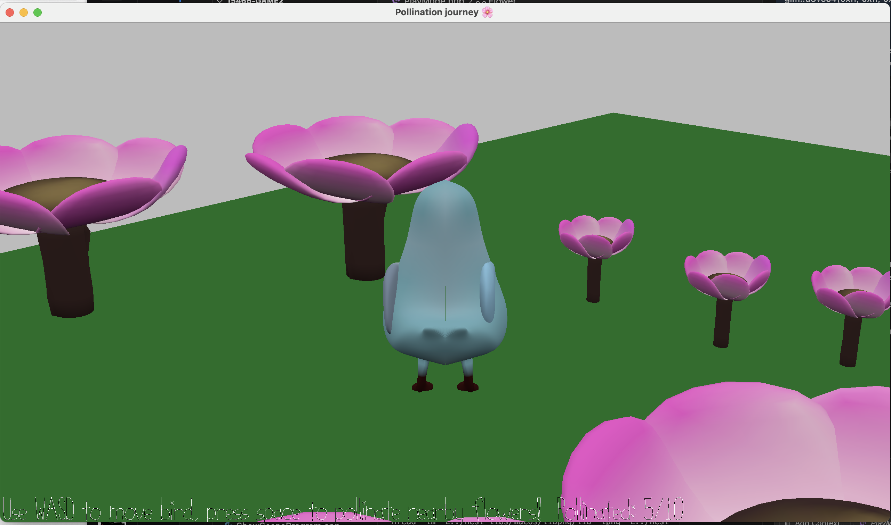

# Pollination Journey 🌸

Author: Fara Yan (fayan)

### Design
In this game, navigate Fauna the sunbird through the garden. Your mission is to pollinate flowers to help them bloom and make the garen thrive. Happy pollinating!

### How To Play

* Use  A / D to turn Fauna left or right, and W / S to move forward or backward.

* When you’re near flowers, press space to pollinate them. Successfully pollinated flowers will bloom and grow larger!

Your goal is to pollinate all flowers to bring your ecosystem to life :)

This game was built with [NEST](NEST.md).
